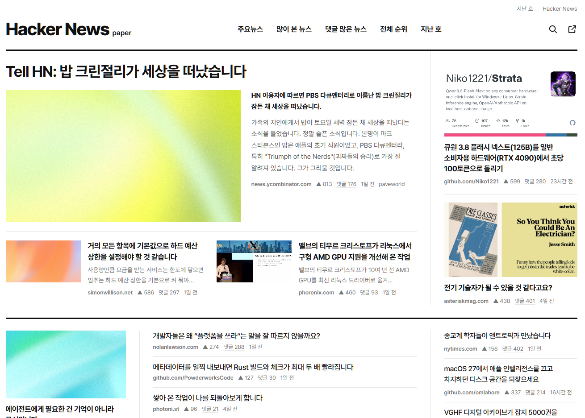
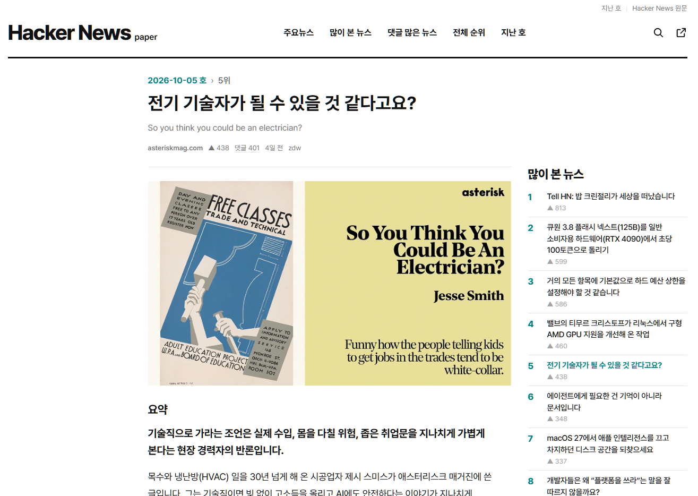

# Hacker News (paper)



전날 [Hacker News](https://news.ycombinator.com/)의 상위 30개 글을 매일 아침 한국어로 번역해, 신문 1면처럼 보여 주는 비공식 사이트입니다.

## 왜 만들었는가

- Hacker News에 자주 접속하며 상시 변동되는 신규 글들에 시간을 쓰지 않기 위해 개발되었습니다. 매일 아침 배송되는 신문처럼 한번만 업데이트되며 빠르게 읽을 수 있도록 신문 형태의 레이아웃을 제공합니다.
   - 품질이 높은 글 선정을 위해 전날 기준으로 고정된 HN의 past 탭을 이용해 글을 수집합니다.
   - 본문과 댓글을 요약해 핵심 내용과 인사이트를 (최대한) 빠르게 알 수 있도록 구현했습니다, 번역과 요약의 경우 더 나은 품질을 위해 계속 프롬포트를 조정할 예정입니다.

## 구성 요소




- **1면**: HN 순위대로 고정된 자리에 기사를 배치합니다. 기사를 따로 분류하지 않으며 HN 사이트의 순위를 그대로 따릅니다. (Show HN 또는 포인트가 50점 미만인 글은 제외한 뒤 30개를 끌어옵니다)
- **기사 페이지**: 기사를 누르면 원문으로 가기 전 중간 페이지가 열립니다. 원문 요약(한 줄 요약, 왜 중요한가, 핵심 내용, HN 반응)과 HN 댓글 번역(최대 30개, HN 댓글란과 같은 순서)이 나오고, 제목을 누르면 원문으로, 그 아래 원제를 누르면 Hacker News 글로 갑니다.

## 실행

저장소 폴더에서 Claude Code로 스킬을 실행할 수 있습니다. 매일 아침 자동으로 돌리려면 Claude 데스크톱 앱 루틴에 `/hn-paper-update` 프롬프트를 등록합니다. 수집기는 전날 HN 1면을 읽는데, HN의 하루 기준은 UTC라서 전날 목록은 한국 시간 오전 9시에 닫힙니다. 루틴은 09시 이후로 잡는 것이 좋습니다.

```
/hn-paper-update                  새로 수집하고 1면 제목, 기사 페이지를 모두 만든다
/hn-paper-update 2026-10-04       그 호의 빠진 번역만 채운다(수집하지 않음, 있는 번역은 그대로 둠)
/hn-paper-update 2026-10-04 49942706   그 기사의 페이지만 다시 만든다
```

기사 30개를 기사마다 새 서브에이전트로 처리하므로 한 번 실행에 15-20분쯤 걸립니다. 번역, 요약 규칙은 스킬과 에이전트 정의 파일에 있습니다.

## 참고

- 이 사이트는 Y Combinator나 Hacker News와 관계가 없습니다. 각 글의 저작권은 원 출처에 있습니다.
- 마크다운은 [Markdig](https://github.com/xoofx/markdig)로 렌더링합니다. 번역본과 댓글은 외부에서 온 글이라 원시 HTML을 막고 http(s), mailto가 아닌 링크는 지웁니다.
- 이미지는 [SkiaSharp](https://github.com/mono/SkiaSharp)로 줄이고, 글꼴은 [Pretendard](https://github.com/orioncactus/pretendard)를 씁니다.

라이선스: MIT